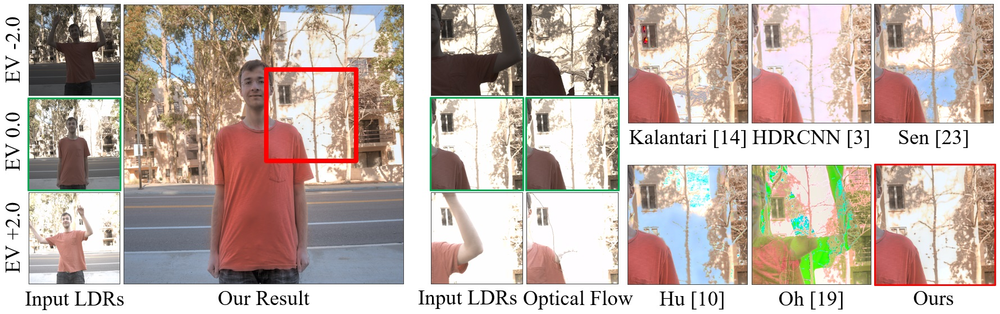

# ECCV'18: Deep High Dynamic Range Imaging with Large Foreground Motions


This is the implementation for [Deep High Dynamic Range Imaging with Large Foreground Motions](https://arxiv.org/abs/1711.08937), Shangzhe Wu, Jiarui Xu, Yu-Wing Tai, Chi-Keung Tang, in ECCV, 2018. More results can be found on the [project page](https://elliottwu.com/projects/hdr/). 

## Get Started
### Prerequisites
- Python 3.5
- [Tensorflow 1.4.0](https://github.com/tensorflow/tensorflow/tree/r1.4)
- OpenCV 3.4 (from [conda-forge](https://anaconda.org/conda-forge/opencv))

### Setup
- Clone this repo: 
```bash
git clone https://github.com/elliottwu/DeepHDR.git
cd DeepHDR
```

- Download pretrained model: (~60MB)
```bash
sh download_pretrained.sh
```

### Demo
```bash
sh test.sh
```

### Train
- Download Kalantari's dataset: (~8GB)
```bash
cd dataset
sh download_dataset.sh
cd ..
```
- Prepare [TFRecord](https://www.tensorflow.org/guide/datasets#consuming_tfrecord_data): (this takes ~10 minutes)
```bash
cd dataset
python convert_to_tfrecord.py
cd ..
```
- Start training: 
```bash
sh train.sh
```
- To monitor training using Tensorboard, copy the following to your terminal and open `localhost:8888` in your browser
```bash
tensorboard --logdir=logs --port=8888
```

### Citation
```
@article{szwuDeepHDR,
  author    = {Shangzhe Wu and Jiarui Xu and Yu{-}Wing Tai and Chi{-}Keung Tang},
  title     = {Deep High Dynamic Range Imaging with Large Foreground Motions},
  journal   = {CoRR},
  volume    = {abs/1711.08937},
  year      = {2017},
  url       = {http://arxiv.org/abs/1711.08937},
}
```
